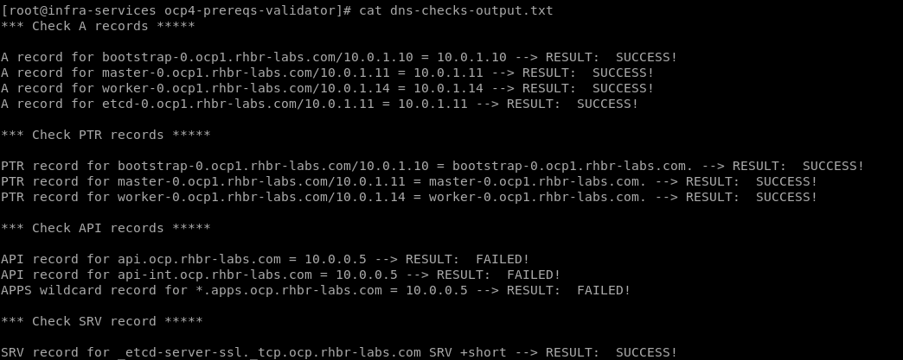

# Pre-requisites Validator for OpenShift 4.2 on vSphere

This repository contains playbooks and roles to help the preparation and validation of the pre-requisites needed for a OpenShift UPI deployment over vSphere.

### Roles

**Network Checks**

This role aims to validate the DNS records. It checks the A, PTR and SRV records based on the servers in hosts file. It creates the file dns-checks-output.txt which contains the result of each validation. Example:



**OCP Prepare Prereqs**

This role prepare a server with the following pre-requisites needed for OCP 4.2 on vSphere:

- DNS
- DHCP
- Apache Webserver
- HAProxy

It also set up the tools above (named.conf, DNS zone files, dhcpd.conf and haproxy.cfg) considering your inventory file.

> **NOTE**: This is not intended to be used in production environments, only for lab, sandbox or studying purposes.


**NFS Server Setup**

Simple role to deploy a NFS server to be used as backend for RWX persistent volumes.

### How to use it

These roles were tested in a RHEL 8 server and Ansible 2.8.

### Prepare workstation

The first step is to register the server and enable the repos:

```
subscription-manager register --username=<rhn_username>
subscription-manager attach --pool=<rhn_pool>
subscription-manager repos --disable='*' \
    --enable=rhel-8-for-x86_64-baseos-rpms \
    --enable=rhel-8-for-x86_64-appstream-rpms
    --enable=ansible-2.8-for-rhel-8-x86_64-rpms  
dnf update -y
reboot
yum install ansible
```

Now configure your hosts file (see the [hosts.example file](hosts.example))

Set up the playbook yaml file with proper parameters. Example:

```
---
- hosts: localhost
  roles:
  - { role: network-checks }
  gather_facts: no  
  vars:
  - control_plane_lb_ip: "10.0.0.10"
  - apps_lb_ip: "10.0.0.10"
  - base_name: "rhbr-labs.com"
  - cluster_name: "ocp"
```

Run the playbook:

```
ansible-playbook -i <hosts file> <playbook>
```
Example:
```
ansible-playbook -i hosts.example prereqs-validator.yml
```


----- 

This is a work-in-progress and the following items is planned to be designed:

- Documentation: Document each role.
- Load Balancer: Validate if LB VIP is set (if possible).
- DHCP: Validate if DHCP is available in the network (if possible).
- Firewall: Validate if required ports are accessible through the network.
